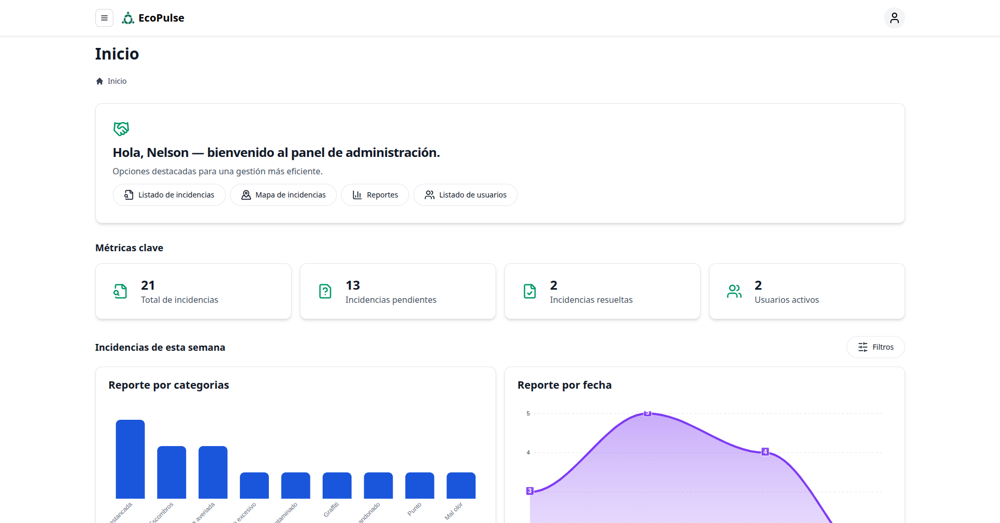
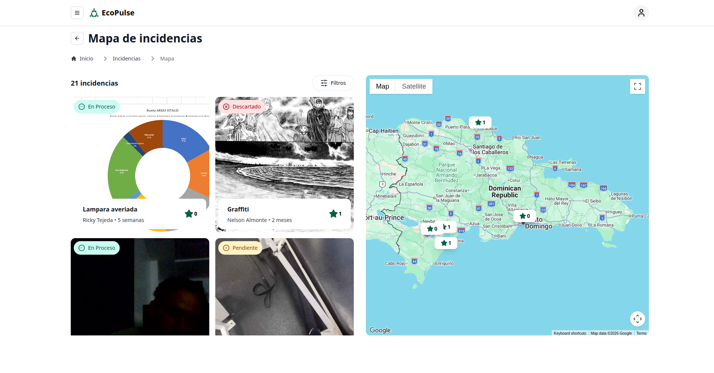
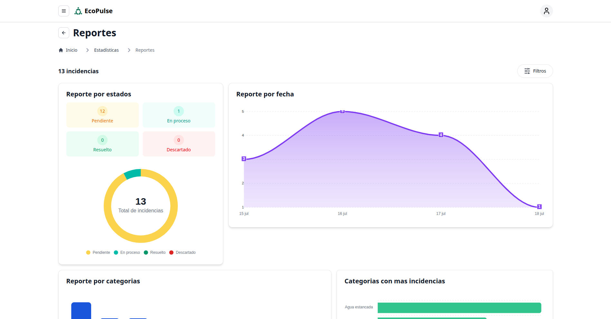
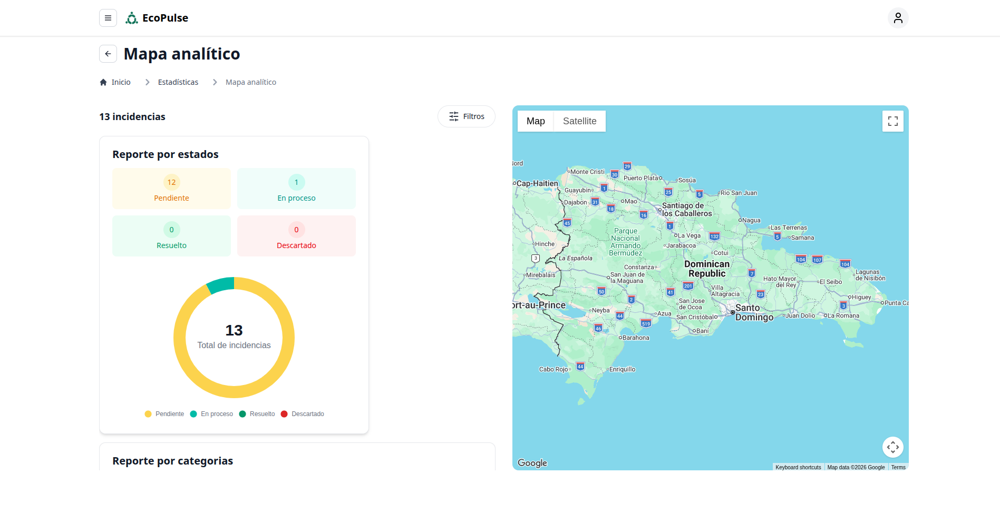
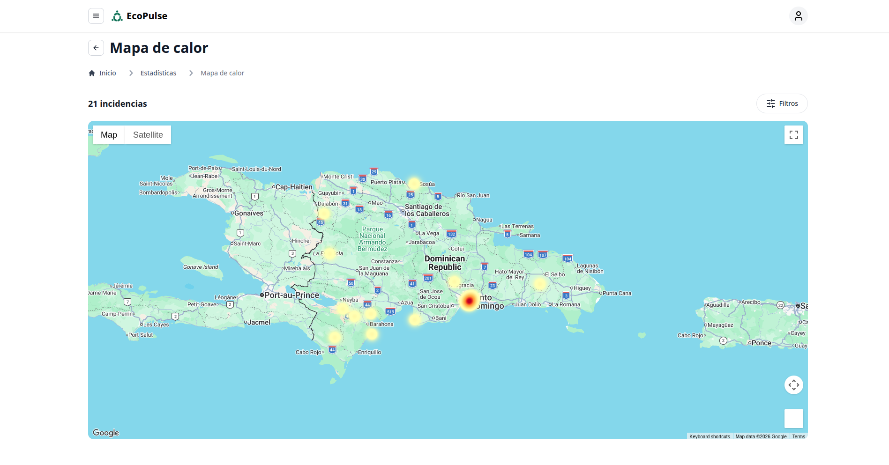
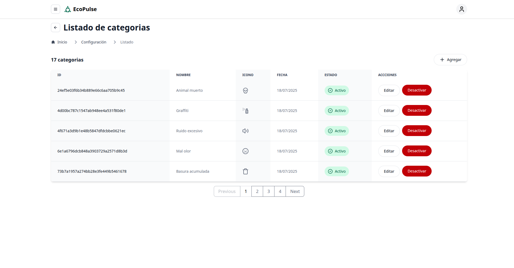

<br />
<div align="center">
  <a href="https://github.com/NelsonAlmonte/EcoPulse">
    
  </a>

  <h2 align="center">EcoPulse Admin</h2>

  <h4 align="center">
    Panel de administración para la gestión y análisis de incidencias urbanas
  </h4>
</div>

<details>
  <summary>Tabla de contenido</summary>
  <ol>
    <li>
      <a href="#acerca-del-proyecto">Acerca del proyecto</a>
    </li>
    <li>
      <a href="#características">Características</a>
    </li>
    <li>
      <a href="#imágenes">Imágenes</a>
    </li>
    <li>
      <a href="#demo">Demo</a>
    </li>
    <li>
      <a href="#tecnologías-utilizadas">Tecnologías utilizadas</a>
    </li>
    <li>
      <a href="#primeros-pasos">Primeros pasos</a>
      <ul>
        <li><a href="#prerrequisitos">Prerrequisitos</a></li>
        <li><a href="#instalación">Instalación</a></li>
      </ul>
    </li>
    <li><a href="#uso">Uso</a></li>
    <li><a href="#contribuciones">Contribuciones</a></li>
    <li><a href="#licencia">Licencia</a></li>
    <li><a href="#contacto">Contacto</a></li>
    <li><a href="#agradecimientos">Agradecimientos</a></li>
  </ol>
</details>

## Acerca del proyecto

EcoPulse Admin es el panel de administración de la plataforma EcoPulse, desarrollado para facilitar la gestión, supervisión y análisis de las incidencias reportadas por la ciudadanía. Proporciona a las entidades responsables una interfaz moderna e intuitiva para administrar reportes, visualizar información geoespacial y obtener estadísticas en tiempo real que apoyen la toma de decisiones.

La aplicación combina mapas interactivos, filtros avanzados y herramientas de análisis que permiten identificar tendencias, priorizar incidencias y monitorear el estado general de la plataforma. Además, centraliza la administración de usuarios y categorías de incidencias desde un único lugar, simplificando las tareas de gestión del sistema.

<p align="right">(<a href="#readme-top">volver arriba</a>)</p>

---

## Características

- **Gestiona los reportes ciudadanos** mediante un listado con filtros avanzados por estado, categoría, fecha y otros criterios.
- **Explora las incidencias en un mapa interactivo**, con una experiencia similar a Airbnb para facilitar la navegación geográfica de los reportes.
- **Administra los usuarios** registrados tanto en la aplicación móvil como en el panel administrativo.
- **Visualiza estadísticas en tiempo real** mediante gráficos por estado, categoría, fecha y otros indicadores relevantes.
- **Analiza las incidencias mediante un panel geoespacial interactivo**, donde las métricas y gráficos se actualizan automáticamente según el área visible del mapa.
- **Identifica las zonas con mayor concentración de incidencias** utilizando un mapa de calor interactivo.
- **Administra las categorías de incidencias**, permitiendo consultar y agregar nuevos tipos de reportes según las necesidades del sistema.

<p align="right">(<a href="#readme-top">volver arriba</a>)</p>

---

## Imágenes

<table align="center">
<tr>
<td align="center">
<br>
<b>Página principal</b>
</td>

<td align="center">
<br>
<b>Mapa de reportes</b>
</td>

<td align="center">
<br>
<b>Estadísticas</b>
</td>
</tr>

<tr>
<td align="center">
<br>
<b>Mapa estadístico</b>
</td>

<td align="center">
<br>
<b>Mapa de calor</b>
</td>

<td align="center">
<br>
<b>Categorías</b>
</td>
</tr>
</table>

<p align="right">(<a href="#readme-top">volver arriba</a>)</p>

---

## Demo

[Demo funcional alojado en Netlify](https://ecopulse-portal.netlify.app/)

<p align="right">(<a href="#readme-top">volver arriba</a>)</p>

---

## Tecnologías utilizadas

[![SvelteKit][SvelteKit]][SvelteKit-url]
[![Tailwindcss][Tailwindcss]][Tailwindcss-url]
[![Supabase][Supabase]][Supabase-url]

### Librerías utilizadas

- [Flowbite Svelte](https://flowbite-svelte.com/)
- [Google Maps](https://www.npmjs.com/package/@googlemaps/js-api-loader)
- [Deck.gl](https://deck.gl/)
- [Lucide Icons](https://lucide.dev/)

<p align="right">(<a href="#readme-top">volver arriba</a>)</p>

---

## Primeros pasos

### Prerrequisitos

Antes de ejecutar el proyecto, asegúrate de tener instalado lo siguiente:

- Node.js 20 o superior
- npm (incluido con Node.js)

### Instalación

1. Clona el repositorio.

```bash
git clone https://github.com/NelsonAlmonte/EcoPulse.git
```

2. Accede al directorio del proyecto.

```bash
cd admin
```

3. Instala las dependencias.

```bash
npm install
```

4. Crea un archivo `.env` en la raíz del proyecto.

5. Renombra el archivo `.env.example` a `.env.development` o `.env.production` y sigue a la siguiente sección.

### Variables de entorno

Antes de ejecutar la aplicación, configura las siguientes variables en el archivo `.env.development` o `.env.production`:

| Variable | Descripción | Dónde obtenerla |
|----------|-------------|-----------------|
| `PUBLIC_API_URL` | URL base de la API desarrollada con NestJS. | Despliegue de la API o entorno local. |
| `PUBLIC_BUCKET_URL` | URL pública del bucket de almacenamiento utilizado para las imágenes de los reportes. | Dashboard de Supabase → **Storage**. |
| `GOOGLE_MAPS_API_KEY` | Clave de API utilizada por Capacitor para la integración nativa de Google Maps. | Google Cloud Console. |
| `PUBLIC_GOOGLE_MAPS_API_KEY` | Clave de API utilizada por Google Maps en la aplicación web. | Google Cloud Console. |
| `PUBLIC_SUPABASE_URL` | URL del proyecto de Supabase. | Dashboard de Supabase → **Settings → API**. |
| `PUBLIC_SUPABASE_PUBLISHABLE_KEY` | Clave pública (Publishable Key) del proyecto de Supabase. | Dashboard de Supabase → **Settings → API**. |

## Uso

### Ejecutar el proyecto en desarrollo

Inicia el servidor de desarrollo con:

```bash
npm run dev
```

La aplicación estará disponible en:

```
http://localhost:5173
```

---

### Compilar para producción

Genera una versión optimizada de la aplicación ejecutando:

```bash
npm run build
```

Para previsualizar la compilación de producción de forma local:

```bash
npm run preview
```

---

### Documentación oficial

Para obtener más información sobre SvelteKit y las tecnologías utilizadas, consulta la documentación oficial:

- [SvelteKit Documentation](https://svelte.dev/docs/kit/introduction)
- [Flowbite Svelte](https://flowbite-svelte.com/)
- [Google Maps JavaScript API](https://developers.google.com/maps/documentation/javascript)
- [Deck.gl](https://deck.gl/)
- [Supabase](https://supabase.com/docs)

<p align="right">(<a href="#readme-top">volver arriba</a>)</p>

---

## Contribuciones

Si tienes alguna sugerencia para mejorar este proyecto, haz un fork del repositorio y crea un Pull Request. También puedes abrir un Issue utilizando la etiqueta **enhancement**.

Si este proyecto te resulta útil, considera darle una ⭐ al repositorio.

1. Haz un Fork del proyecto.
2. Crea una nueva rama (`git checkout -b feature/nueva-funcionalidad`).
3. Realiza tus cambios (`git commit -m 'Agrega nueva funcionalidad'`).
4. Sube tus cambios (`git push origin feature/nueva-funcionalidad`).
5. Abre un Pull Request.

<p align="right">(<a href="#readme-top">volver arriba</a>)</p>

---

## Licencia

Distribuido bajo la licencia MIT. Consulta el archivo `LICENSE` para más información.

<p align="right">(<a href="#readme-top">volver arriba</a>)</p>

---

## Contacto

Nelson Almonte - almontetejedanelson@gmail.com

Repositorio del proyecto:

https://github.com/NelsonAlmonte/EcoPulse

<p align="right">(<a href="#readme-top">volver arriba</a>)</p>

---

## Agradecimientos

- [Best-README-Template](https://github.com/othneildrew/Best-README-Template)
- [SvelteKit](https://svelte.dev/docs/kit/introduction)
- [Flowbite Svelte](https://flowbite-svelte.com/)
- [Tailwind CSS](https://tailwindcss.com/)
- [Google Maps Platform](https://developers.google.com/maps)
- [Deck.gl](https://deck.gl/)
- [Supabase](https://supabase.com/)
- [Lucide Icons](https://lucide.dev/)
- [Shields.io](https://shields.io/)

<p align="right">(<a href="#readme-top">volver arriba</a>)</p>

---

[SvelteKit]: https://img.shields.io/badge/SvelteKit-FF3E00?style=for-the-badge&logo=svelte&logoColor=white
[SvelteKit-url]: https://svelte.dev/docs/kit/introduction

[Tailwindcss]: https://img.shields.io/badge/Tailwind_CSS-38B2AC?style=for-the-badge&logo=tailwind-css&logoColor=white
[Tailwindcss-url]: https://tailwindcss.com/

[Supabase]: https://img.shields.io/badge/Supabase-3ECF8E?style=for-the-badge&logo=supabase&logoColor=white
[Supabase-url]: https://supabase.com/

[image-1]: images/1.png
[image-2]: images/2.png
[image-3]: images/3.png
[image-4]: images/4.png
[image-5]: images/5.png
[image-6]: images/6.png