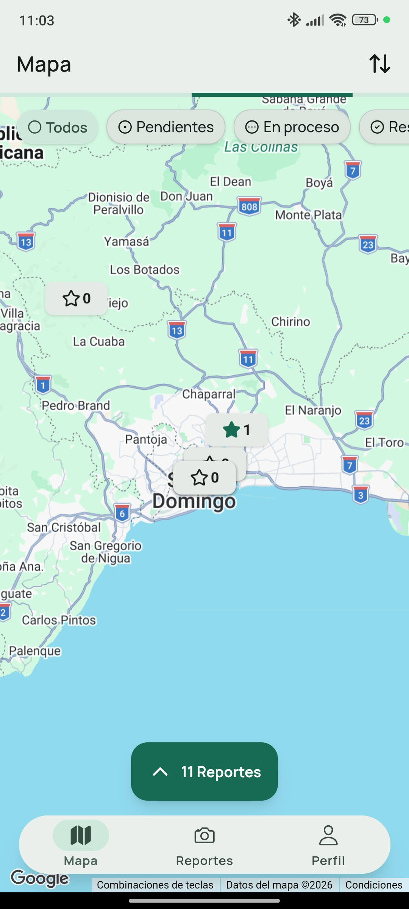
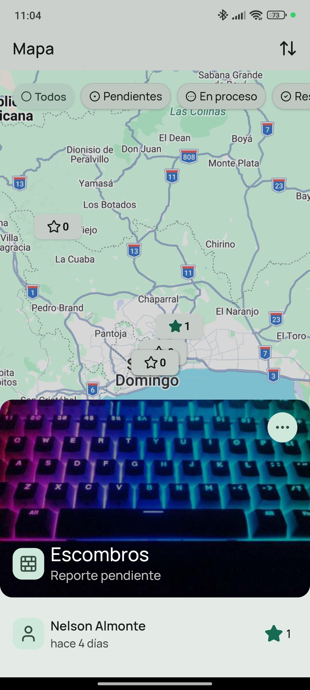
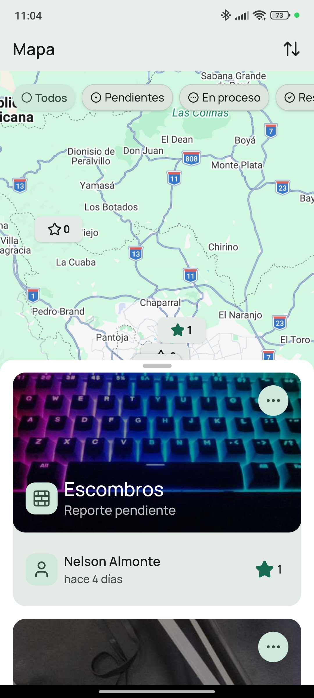
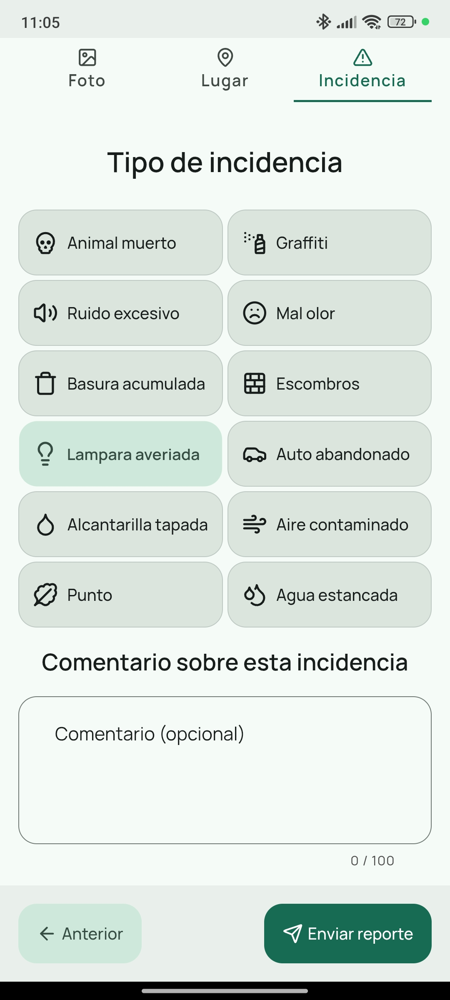
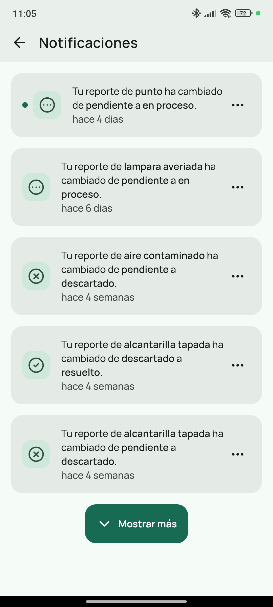
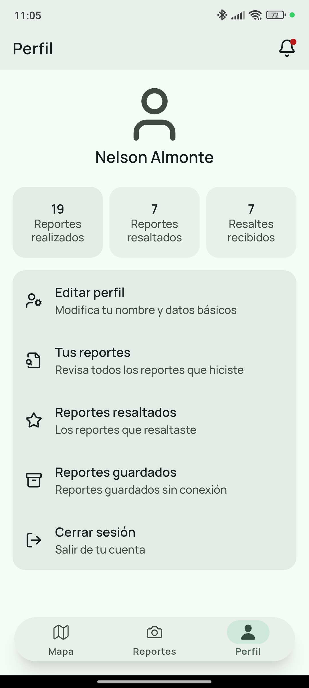

<br />
<div align="center">
  <a href="https://github.com/NelsonAlmonte/EcoPulse">
    
  </a>

  <h2 align="center">EcoPulse Mobile</h2>
  <hr>
  <h4 align="center">
    Aplicación móvil para el reporte ciudadano de incidencias urbanas
  </h4>
</div>

<details>
  <summary>Tabla de contenido</summary>
  <ol>
    <li>
      <a href="#acerca-del-proyecto">Acerca del proyecto</a>
    </li>
    <li>
      <a href="#características">Características</a>
    </li>
    <li>
      <a href="#imágenes">Imágenes</a>
    </li>
    <li>
      <a href="#demo">Demo</a>
    </li>
    <li>
      <a href="#tecnologías-utilizadas">Tecnologías utilizadas</a>
    </li>
    <li>
      <a href="#primeros-pasos">Primeros pasos</a>
      <ul>
        <li><a href="#prerrequisitos">Prerrequisitos</a></li>
        <li><a href="#instalación">Instalación</a></li>
      </ul>
    </li>
    <li><a href="#uso">Uso</a></li>
    <li><a href="#contribuciones">Contribuciones</a></li>
    <li><a href="#licencia">Licencia</a></li>
    <li><a href="#contacto">Contacto</a></li>
    <li><a href="#agradecimientos">Agradecimientos</a></li>
  </ol>
</details>

## Acerca del proyecto

EcoPulse Mobile es una aplicación móvil de participación ciudadana que permite a los usuarios reportar incidencias urbanas de forma rápida, sencilla y desde cualquier lugar. Mediante el uso de la cámara del dispositivo, geolocalización y sincronización en tiempo real, la aplicación facilita la comunicación entre la comunidad y las entidades responsables de la gestión de espacios públicos.

Los ciudadanos pueden crear reportes, consultar incidencias cercanas en un mapa interactivo, apoyar aquellas que consideran prioritarias y recibir notificaciones sobre el estado de sus reportes. Además, EcoPulse permite registrar incidencias incluso sin conexión a Internet, sincronizándolas automáticamente cuando el dispositivo recupera la conectividad.

Su objetivo es fomentar la participación ciudadana y contribuir a una gestión más eficiente de las incidencias que afectan a la comunidad.

<p align="right">(<a href="#readme-top">volver arriba</a>)</p>

---

## Características

- **Reporta incidencias** utilizando la cámara del dispositivo y geolocalización en tiempo real.
- **Explora un mapa interactivo** con una experiencia inspirada en Airbnb para descubrir incidencias cercanas y filtrarlas según distintos criterios.
- **Apoya reportes importantes** mediante un sistema de respaldos que ayuda a priorizar las incidencias con mayor impacto para la comunidad.
- **Consulta tus reportes** y encuentra rápidamente cualquier incidencia enviada mediante filtros de búsqueda.
- **Accede a los reportes que has apoyado** y realiza seguimiento de ellos desde un solo lugar.
- **Reporta sin conexión a Internet**, almacenando la información localmente hasta que el dispositivo vuelva a tener acceso a la red.
- **Recibe notificaciones** cuando el estado de tus reportes cambie o existan nuevas actualizaciones.

<p align="right">(<a href="#readme-top">volver arriba</a>)</p>

---

## Imágenes

<div align="center">

<a href="#">
  
</a>

<a href="#">
  
</a>

<a href="#">
  
</a>

<br><br>

<a href="#">
  
</a>

<a href="#">
  
</a>

<a href="#">
  
</a>

</div>
<p align="right">(<a href="#readme-top">volver arriba</a>)</p>

---

## Demo

<p align="right">(<a href="#readme-top">volver arriba</a>)</p>

---

## Tecnologías utilizadas

[![Ionic][Ionic]][Ionic-url]
[![Angular][Angular]][Angular-url]
[![Tailwindcss][Tailwindcss]][Tailwindcss-url]

### Librerías utilizadas

- [Google Maps](https://www.npmjs.com/package/@googlemaps/js-api-loader)
- [Supabase](https://supabase.com/)
- [Lucide Icons](https://lucide.dev/)

<p align="right">(<a href="#readme-top">volver arriba</a>)</p>

---

## Primeros pasos

### Prerrequisitos

Antes de ejecutar el proyecto, asegúrate de tener instalado lo siguiente:

- Node.js 20 o superior
- npm (incluido con Node.js)
- Ionic CLI
- Android Studio (para ejecutar la aplicación en dispositivos Android)
- JDK 17 o superior

### Instalación

1. Clona el repositorio.

```bash
git clone https://github.com/NelsonAlmonte/EcoPulse.git
```

2. Accede al directorio del proyecto.

```bash
cd mobile
```

3. Instala las dependencias.

```bash
npm install
```

4. Crea el archivo `.env` utilizando el archivo de ejemplo correspondiente y configura las variables de entorno necesarias.

## Uso

### Ejecutar el proyecto en desarrollo

Inicia el servidor de desarrollo con:

```bash
ionic serve
```

La aplicación estará disponible en:

```
http://localhost:8100
```

---

### Ejecutar la aplicación en Android

Sincroniza los cambios con el proyecto nativo:

```bash
npx cap sync android
```

Luego abre el proyecto en Android Studio:

```bash
npx cap open android
```

También puedes ejecutar la aplicación directamente desde la línea de comandos:

```bash
ionic capacitor run android
```

---

### Compilar para producción

Genera la versión optimizada de la aplicación:

```bash
ionic build
```

Después sincroniza los archivos web con Capacitor:

```bash
npx cap sync
```

A partir de este punto podrás generar el APK o AAB utilizando Android Studio.

---

### Scripts incluidos

El proyecto incluye dos scripts para facilitar la instalación de la aplicación en dispositivos Android:

- **install-dev.sh**
  - Compila e instala la versión de desarrollo.

- **install-prod.sh**
  - Compila e instala la versión de producción.

> Estos scripts están pensados únicamente para dispositivos Android.

---

### Documentación oficial

Para obtener más información sobre Ionic y Capacitor, consulta la documentación oficial:

- [Ionic CLI](https://ionicframework.com/docs/cli)
- [Running an App](https://ionicframework.com/docs/developing/starting)
- [Building for Production](https://ionicframework.com/docs/deployment/play-store)
- [Capacitor Android](https://capacitorjs.com/docs/android)

<p align="right">(<a href="#readme-top">volver arriba</a>)</p>

---

## Contribuciones

Si tienes alguna sugerencia para mejorar este proyecto, haz un fork del repositorio y crea un Pull Request. También puedes abrir un Issue utilizando la etiqueta **enhancement**.

Si este proyecto te resulta útil, considera darle una ⭐ al repositorio.

1. Haz un Fork del proyecto.
2. Crea una nueva rama (`git checkout -b feature/nueva-funcionalidad`).
3. Realiza tus cambios (`git commit -m 'Agrega nueva funcionalidad'`).
4. Sube tus cambios (`git push origin feature/nueva-funcionalidad`).
5. Abre un Pull Request.

<p align="right">(<a href="#readme-top">volver arriba</a>)</p>

---

## Licencia

Distribuido bajo la licencia MIT. Consulta el archivo `LICENSE` para más información.

<p align="right">(<a href="#readme-top">volver arriba</a>)</p>

---

## Contacto

Nelson Almonte - almontetejedanelson@gmail.com

Repositorio del proyecto:

https://github.com/NelsonAlmonte/EcoPulse

<p align="right">(<a href="#readme-top">volver arriba</a>)</p>

---

## Agradecimientos

- [Best-README-Template](https://github.com/othneildrew/Best-README-Template)
- [Ionic Framework](https://ionicframework.com/)
- [Angular](https://angular.dev/)
- [Capacitor](https://capacitorjs.com/)
- [Supabase](https://supabase.com/)
- [Google Maps Platform](https://developers.google.com/maps)
- [Lucide Icons](https://lucide.dev/)
- [Shields.io](https://shields.io/)

<p align="right">(<a href="#readme-top">volver arriba</a>)</p>

---

[Ionic]: https://img.shields.io/badge/Ionic-3880FF?style=for-the-badge&logo=ionic&logoColor=white
[Ionic-url]: https://ionicframework.com/

[Angular]: https://img.shields.io/badge/Angular-DD0031?style=for-the-badge&logo=angular&logoColor=white
[Angular-url]: https://angular.dev/

[Tailwindcss]: https://img.shields.io/badge/Tailwind_CSS-38B2AC?style=for-the-badge&logo=tailwind-css&logoColor=white
[Tailwindcss-url]: https://tailwindcss.com/

[image-1]: images/image-1.jpg
[image-2]: images/image-2.jpg
[image-3]: images/image-3.jpg
[image-4]: images/image-4.jpg
[image-5]: images/image-5.jpg
[image-6]: images/image-6.jpg